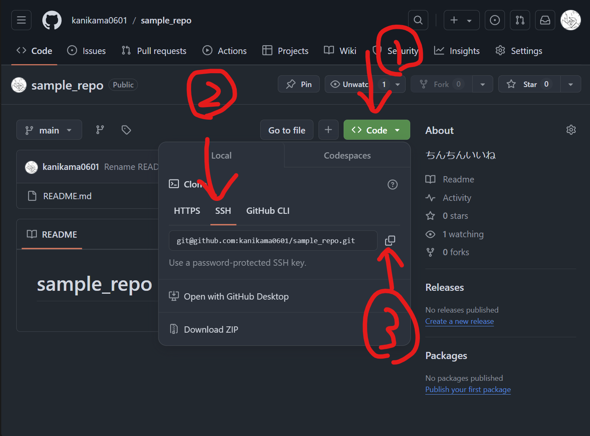

# Gitの使い方
GUIがメインのWindows上でGitを使うと、フォルダが増えて圧迫感が出る為、WSL上で動作させることを推奨します。
今回はWSL(Ubuntu)上で動作させるマニュアルです。  
<br>

## キーの作成＆同期
### 1.フォルダの作成
まず、.sshフォルダが無いと思われるので、作成します。  
```shell
mkdir ~/.ssh
```
<br>

### 2.sshキーを作成
先ほど作成したフォルダを開き、ssh-keygenを実行します。
以下のコマンドになります。
```shell
cd ~/.ssh
ssh-keygen -t rsa
```
これを実行すると、  
まず以下が表示されます。  
**Enter file in which to save the key (/home/kanikama0601/.ssh/id_rsa):**  
特に指定がない限り、このままEnterでOKです。  
<br>

次に以下が表示されます。  
**Enter passphrase (empty for no passphrase):**  
パスフレーズ(パスワード)は不要なので、このままEnterを押してください。  
<br>

最後に以下が表示されます。  
**Enter same passphrase again:** 
これも、そのままEnterを押してください。  
<br>

すると、以下が表示されるのでこれで完了です。
```
Your identification has been saved in /home/kanikama0601/.ssh/id_rsa
Your public key has been saved in /home/kanikama0601/.ssh/id_rsa.pub
The key fingerprint is:
SHA256:9efJkLRLtOthwsvhcpwac/cEklWojcjF1e4/1l9rxNM kanikama0601@LAPTOP-3H16INMU
The key's randomart image is:
+---[RSA 3072]----+
|         . ..o.  |
|          o ...  |
|       . o.++.   |
|        o.o*.+.  |
|        S o O.o .|
|         . o O.=E|
|        o.=.* *.+|
|        .*+B + +=|
|        .++ . +.+|
+----[SHA256]-----+
```
<br>

### 3.GitHubにキーを登録
まず、GitHubにブラウザでアクセスし、ログインします。  
次に、Settingsを開きます。  

<br>

次に、SSH and GPG Keysを選択します。

<br>

次に、右上のNew SSH Keyを押します  

<br>

Titleは何でもOKです。  
環境別で分かるようにしたいので、今回は「パソコン名 WSL」にしました。  
Key typeはそのままでOKです。  
Keyは、先程作成したものを使います。  
.sshフォルダにある、id_rsa.pubを指定します。  
一度.sshフォルダを開き、id_rsa.pubの中身を表示させます。
```shellscript
cd ~/.ssh
cat id_rsa.pub
```
恐らく、以下のような文字列が表示されます。  
```
ssh-rsa
～
クソ長い文
～
kanikama0601@LAPTOP-3H16INMU
```
最後の部分はWSLのユーザー名です。  
これを丸ごとコピペします。  
完了すると以下のようになります。  

これで準備完了です。  
<br>

## レポジトリ作成、アップ
### 1.レポジトリの作成
まず、ホーム画面のこちらのボタンからレポジトリを作成します。  

<br>

Repository nameは、レポジトリの名前を入力してください。    
Descriptionはレポジトリの説明を入れてください。  
入れなくてもかまいません。  
<br>

PublicとPrivateはそれぞれ、  
公開、非公開です。  
公開の場合は誰でも閲覧、編集が可能で、  
非公開の場合は、collabolatorで指定した人だけ閲覧、編集可能です。  
<br>

Add a README fileはREADME.mdを作成します。  
これは後で作れるのでどっちでも良いです。  
<br>

Add .gitignoreは.gitignoreを作成します。  
これは、gitでpushする際、特定のファイル、フォルダをpushをしないように設定できるものです。  
これも後ほど作れるのでどっちでも良いです。  
Choose a licenseはNoneのままでOKです。
<br>


<br>

これでレポジトリの作成は完了です。  
<br>

### 2.レポジトリのクローン
次に、レポジトリのクローンをWSL内に作成します。  
①のSSHを選択し、  
②のコピーを押します。  

<br>

もし、READMEファイルを作成した場合は、  
①のCodeを選択、  
②のSSHを選択、
最後に③のコピーを押します。  

<br>

次に、WSLに移動し、ホームディレクトリ(起動したときのディレクトリ)で、git cloneを使います。
```shell
git clone git@github.com:kanikama0601/sample_repo.git
```
すると、レポジトリ名のフォルダが作成されます。  
<br>

こちらで作業をします。  
<br>

### 3.ファイルのアップロード
フォルダ内でファイルを作成、変更した場合、GitHubでは変更されていないので変更を加えます。  
<br>

**1.対象のフォルダに移動します。**   
移動してない場合は、そちらに移動してください。  
```shell
cd sample_repo
```
<br>

**2.フォルダ中身を一旦キューに移します。**  
```shell
git add .
```
.は現在のフォルダの中身すべてを指定しています。  
<br>

**3.変更をリポジトリに適応させます。**  
こちらをcommitと呼びます。  
```shell
git commit -m "new commit"
```
-mはコメントをつけるオプションです。  
これにより、適応されますが、まだサーバー上には適応されていません。  
<br>

**4.最後にpushをします。**  
```shell
git push
```
<br>

これで完了です。